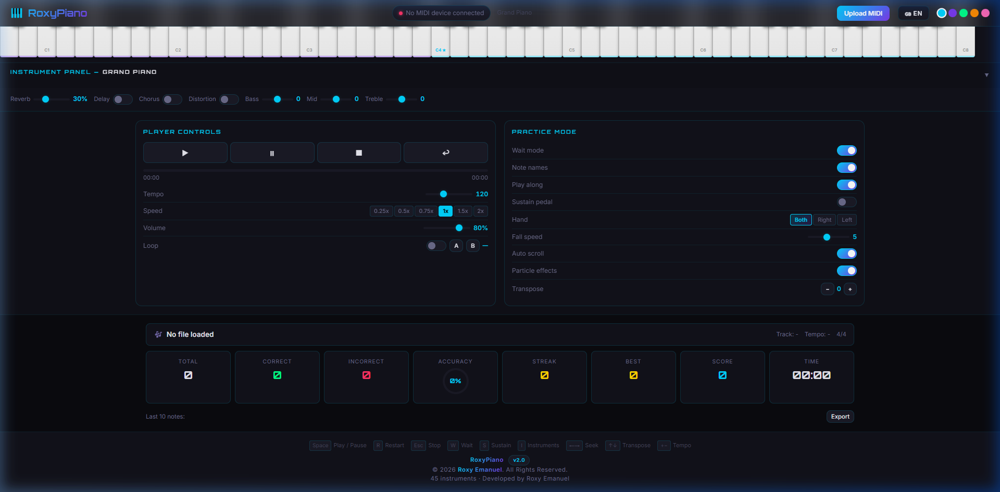
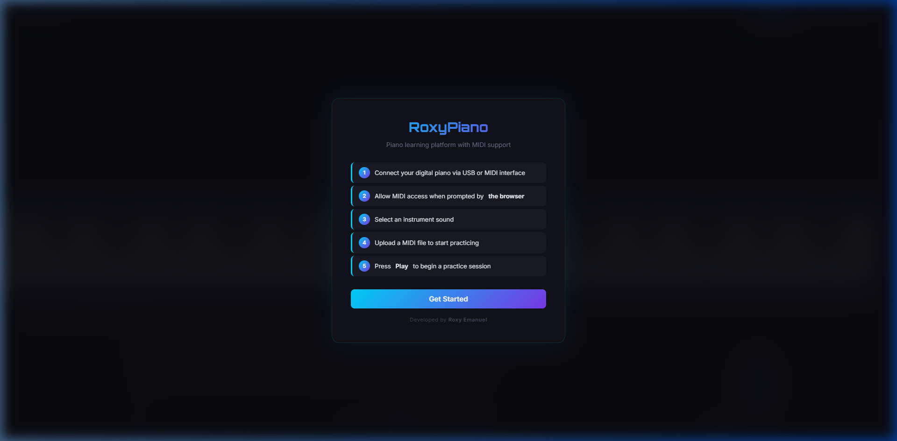
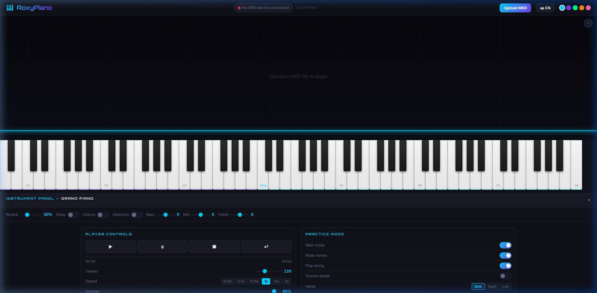
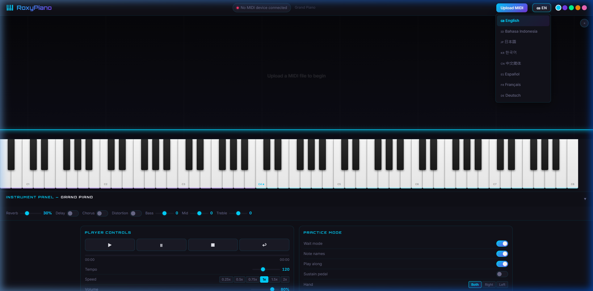

# RoxyPiano v2.0

Piano learning platform with MIDI support. Built with modular architecture, 45 instruments, falling notes visualization, and real-time practice scoring. Runs entirely client-side — no server required.



## Features

- **45 Instruments** — Grand Piano, Electric Piano, Organ, Strings, Brass, Synths, and World instruments powered by Tone.js
- **MIDI Keyboard Support** — Connect any USB MIDI controller via Web MIDI API. Plug-and-play, no drivers needed
- **Falling Notes** — Canvas 2D rendering at 60fps with accurate hit zone detection
- **Practice Mode** — Wait mode pauses playback until you press the correct key. Play Along mode scores in real-time
- **Audio Effects** — Reverb, Delay, Chorus, Distortion, and 3-Band EQ (Bass, Mid, Treble)
- **8 Languages** — English, Bahasa Indonesia, 日本語, 한국어, 中文简体, Español, Français, Deutsch
- **Theme Customization** — Cyan, Purple, Green, Orange, and Pink color themes with particle effects
- **PWA Ready** — Installable as a standalone desktop or mobile app

## Screenshots

| Welcome Screen | Main Interface | Language Support |
|:-:|:-:|:-:|
|  |  |  |

## Getting Started

1. Open `index.html` in Google Chrome (recommended for full Web MIDI API support)
2. Connect a MIDI keyboard via USB (optional)
3. Allow MIDI access when prompted by the browser
4. Select an instrument from the instrument panel
5. Upload a MIDI file or play freely
6. Press **Play** to begin a practice session

## Architecture

```
RoxyPiano/
├── index.html              # Entry point
├── css/                    # Modular stylesheets
│   ├── variables.css       # Design tokens
│   ├── components.css      # Reusable components
│   ├── layout.css          # Page layout
│   ├── piano.css           # Piano keyboard
│   ├── canvas.css          # Falling notes canvas
│   ├── panels.css          # Instrument panel
│   ├── controls.css        # Player & practice controls
│   └── stats.css           # Statistics display
├── js/
│   ├── lang/               # i18n system (8 languages)
│   │   ├── core.js         # Translation engine
│   │   ├── en.js           # English (default)
│   │   ├── id.js           # Bahasa Indonesia
│   │   ├── ja.js           # Japanese
│   │   ├── ko.js           # Korean
│   │   ├── zh.js           # Chinese (Simplified)
│   │   ├── es.js           # Spanish
│   │   ├── fr.js           # French
│   │   └── de.js           # German
│   ├── config/             # Constants & instrument catalog
│   ├── core/               # State management & game loop
│   ├── audio/              # Tone.js engine & effects
│   ├── midi/               # MIDI input & file parser
│   ├── ui/                 # DOM rendering & interactions
│   └── app.js              # Application bootstrap
├── manifest.json           # PWA manifest
├── favicon.svg             # App icon
└── docs/                   # Documentation & screenshots
```

## Dependencies

| Library | Version | Purpose |
|---------|---------|---------|
| [Tone.js](https://tonejs.github.io/) | 14.8.49 | Audio synthesis engine |
| [WebMidi.js](https://webmidijs.org/) | 3.0.6 | MIDI device interface |
| [@tonejs/midi](https://github.com/Tonejs/Midi) | 2.0.28 | MIDI file parser |

All dependencies are loaded via CDN. No build tools or package manager required.

## Adding a New Language

1. Create a new file in `js/lang/` (e.g., `pt.js`)
2. Define the translation object following the key structure in `en.js`
3. Register the language in `LANGUAGES` and `LANG_PACKS` in `js/lang/core.js`
4. Add a `<script>` tag in `index.html` before `core.js`

## License

© 2026 Roxy Emanuel. All Rights Reserved.

This software is proprietary. See [LICENSE](LICENSE) for details.
